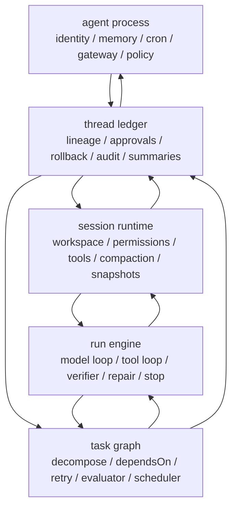

# opencode-agent-os Architecture

## Thesis

Build `opencode-agent-os` as a runtime-native hybrid harness:

- keep `opencode` as the `session + run` kernel
- absorb `hermes-agent` strengths at the `thread + agent process + gateway + cron + memory` layers
- do not port Hermes Python modules one-for-one into TypeScript
- organize the repo by runtime objects, not by UI surface or tool categories

This follows the control-loop roadmap in `mixed harness three-stage roadmap`:

1. controllable execution
2. self-correcting execution
3. governed execution

## Why This Hybrid

`opencode` is strongest where local coding agents usually lose control first:

- session state
- workspace restore and sync
- permission gates
- tool contracts
- subagent task spawning

Source notes:

- `opencode/packages/opencode/src/session/index.ts`
- `opencode/packages/opencode/src/control-plane/workspace.ts`
- `opencode/packages/opencode/src/permission/index.ts`
- `opencode/packages/opencode/src/tool/task.ts`
- `opencode/packages/opencode/src/agent/agent.ts`
- `opencode/packages/opencode/src/skill/discovery.ts`
- `opencode/packages/opencode/src/plugin/loader.ts`

`hermes-agent` is strongest where long-running agent systems usually lose control first:

- persistent agent process ownership
- multi-platform gateway routing
- cron and background delivery
- memory orchestration
- pluggable context engines
- shared state across CLI and gateway sessions

Source notes:

- `hermes-agent/run_agent.py`
- `hermes-agent/gateway/run.py`
- `hermes-agent/gateway/session.py`
- `hermes-agent/cron/scheduler.py`
- `hermes-agent/agent/memory_manager.py`
- `hermes-agent/agent/context_engine.py`
- `hermes-agent/tools/registry.py`
- `hermes-agent/hermes_state.py`

The hybrid should therefore preserve `opencode` as the kernel and move Hermes ideas into outer layers.

## Primary Object Stack

Do not treat the run loop as the kernel. The kernel is the object stack:

1. `session`
2. `run engine`
3. `task graph`
4. `thread`
5. `agent process`

Definitions:

- `session`: the current workbench; permissions, tools, environment, compaction, snapshots
- `run engine`: one model and tool execution cycle
- `task graph`: decomposition, retry, evaluator routing, parallel ownership
- `thread`: durable lineage, approvals, rollback, summaries, audit
- `agent process`: the long-lived actor that owns gateway presence, automation, memory, and policy

## Target Architecture



## Design Rules

1. `session` stays repo-native.
   Keep the `opencode` contract around worktree, permission, tool invocation, and session sync as the foundation.

2. `thread` is a governance ledger, not a chat log.
   Every approval, evaluator result, rollback marker, schedule handoff, and summary belongs here.

3. `task graph` is introduced only after session control is stable.
   Hermes-style long-running power is useful only if task execution is already deterministic enough to trust.

4. `agent process` is outermost.
   Gateway, cron, memory, and janitor loops should not leak into the session kernel.

5. memory is contextual, not magical.
   Prefer recall blocks, thread summaries, and repository artifacts before adding heavy vector infrastructure.

## What To Take From opencode

Take directly or near-directly:

- session metadata model
- permission request and reply flow
- workspace restore and synchronization semantics
- provider abstraction via `ai` and provider adapters
- subagent tool contract
- skill and plugin discovery model
- event-driven runtime boundaries

Do not weaken these by introducing gateway or automation concerns into the session package.

## What To Take From hermes-agent

Take conceptually, then reimplement in TypeScript:

- long-lived `agent process` abstraction
- gateway `session source` and routing context
- cron scheduler with delivery targets and locking semantics
- memory manager abstraction
- pluggable context engine interface
- shared durable session/thread store with full-text search
- janitor and background governance loops

Do not copy:

- the large single-file `run_agent.py` center of gravity
- import-time side-effect registration as the main extension mechanism
- environment bridging spread across unrelated runtime layers

## Repo Layout

This is the target repo shape. The current scaffold intentionally keeps only the top-level directories thin.

```text
.
|-- apps
|   |-- cli
|   |-- control-plane
|   `-- gateway
|-- docs
|   `-- opencode-agent-os-architecture.md
|-- packages
|   |-- automation
|   |-- config
|   |-- evaluators
|   |-- gateway-core
|   |-- memory
|   |-- provider
|   |-- runtime-process
|   |-- runtime-runner
|   |-- runtime-session
|   |-- runtime-task
|   |-- runtime-thread
|   |-- shared
|   |-- skills
|   |-- storage
|   `-- tools
`-- workers
    |-- cron
    |-- daemon
    `-- janitor
```

## Package Responsibilities

### `packages/shared`

Small shared contracts only:

- ids
- event envelopes
- zod schemas
- error types
- telemetry tags

Avoid business logic here.

### `packages/config`

Configuration loading and validation:

- workspace config
- model/provider config
- gateway config
- automation config
- feature flags

### `packages/storage`

Durable data layer:

- SQLite schema and migrations
- repositories for sessions, threads, tasks, approvals, schedules, memories
- event log and projections
- full-text search

### `packages/provider`

Model abstraction:

- `ai` SDK integration
- provider adapters
- model capability metadata
- routing and fallback policy

### `packages/runtime-session`

The `opencode` kernel:

- session lifecycle
- workspace binding
- permission requests
- snapshots, revert markers, compaction
- tool-call side effect boundaries

### `packages/runtime-runner`

Single-run execution engine:

- prompt assembly
- tool loop
- verifier hooks
- repair and retry inside one run
- stop conditions

### `packages/runtime-task`

Task graph and evaluators:

- task DAG
- dependency resolution
- retry ownership
- evaluator routing
- parallel work partitioning

### `packages/runtime-thread`

Governance ledger:

- thread lifecycle
- approval records
- summaries
- rollback checkpoints
- artifact indexing
- handoff history

### `packages/runtime-process`

Long-lived agent identity:

- process lifecycle
- active thread registry
- memory coordination
- automation ownership
- janitor policy triggers

### `packages/tools`

Tool registry and execution contract:

- tool schema
- permission integration
- local tools
- MCP bridge
- tool span instrumentation

### `packages/memory`

Memory orchestration:

- recall block building
- thread summary recall
- user and workspace profile adapters
- optional external memory provider bridge

### `packages/skills`

Skill packaging and discovery:

- local skill layout
- remote skill index support
- skill manifest and execution metadata

### `packages/automation`

Recurring and deferred execution:

- cron schedules
- heartbeat schedules
- delivery targets
- schedule ownership by thread or process

### `packages/gateway-core`

Channel abstraction:

- normalized inbound events
- outbound delivery contract
- session source metadata
- adapter lifecycle

### `packages/evaluators`

Independent feedback surfaces:

- deterministic checks
- browser checks
- design/code review evaluators
- confidence and acceptance scoring

## Applications

### `apps/cli`

Terminal-first workbench:

- session UX
- tool output streaming
- approvals
- task status
- thread navigation

### `apps/gateway`

Messaging entrypoint:

- webhook polling or sockets
- adapter boot
- inbound normalization
- route to thread or process

### `apps/control-plane`

Human governance UI:

- threads
- task graph
- approvals
- schedules
- memory traces
- run and evaluator visibility

## Workers

### `workers/daemon`

Hosts long-lived agent processes and owns background task dispatch.

### `workers/cron`

Executes due schedules with delivery and lock semantics.

### `workers/janitor`

Runs cleanup and governance loops:

- stale thread compaction
- orphan task cleanup
- docs and artifact gardening
- structural invariant checks

## Recommended TypeScript Stack

Keep the dependency set small and layered.

### Core runtime

- `typescript`
- `effect`
- `zod`
- `remeda`
- `ulid`

Why:

- `effect` matches `opencode` and is strong for services, retries, fibers, and structured concurrency
- `zod` keeps public schemas simple

### Model and tool execution

- `ai`
- `@ai-sdk/openai`
- `@ai-sdk/anthropic`
- `@ai-sdk/google`
- `@ai-sdk/openai-compatible`
- `@modelcontextprotocol/sdk`
- `cross-spawn`
- `ignore`
- `chokidar`
- `partial-json`

### Storage and search

- `drizzle-orm`
- `drizzle-kit`
- Bun SQLite in Phase 1
- optional `libsql` or Postgres adapter in Phase 3

### HTTP and gateway

- `hono`
- `@hono/node-server`
- `ws` only where required by adapters
- platform SDKs in adapter-specific packages, not in the kernel

### CLI and control plane

- terminal UX: reuse `opencode` TUI direction
- web UI: `solid-js` plus `vite` if you keep close to `opencode`

### Scheduling and background work

- `cron-parser`
- `effect/Schedule`

### Observability

- `@effect/opentelemetry`
- `@opentelemetry/sdk-trace-node`
- `@opentelemetry/exporter-trace-otlp-http`

## Minimal Data Model

Start with these tables:

- `threads`
- `sessions`
- `tasks`
- `task_edges`
- `runs`
- `artifacts`
- `approvals`
- `schedules`
- `memories`
- `channel_bindings`
- `agent_processes`

Important rule:

- `sessions` record local execution state
- `threads` record governance and continuity
- `tasks` record schedulable work
- `runs` record one concrete model or tool execution attempt

Do not collapse all four into one table.

## Three-Phase Delivery Plan

### Phase 1: controllable execution

Goal:

- rebuild `opencode` session kernel in this repo first
- add thread records without full task DAG complexity

Build:

- `shared`
- `config`
- `storage`
- `provider`
- `runtime-session`
- `runtime-runner`
- `tools`
- `apps/cli`

Acceptance:

- one session can run tools against one workspace
- permissions are durable
- every run leaves thread artifacts and verifier output

### Phase 2: self-correcting execution

Goal:

- add independent evaluators and schedulable tasks

Build:

- `runtime-task`
- `evaluators`
- browser and log sensors
- first repair loop

Acceptance:

- a task can fail evaluation, repair itself, and retry with evidence

### Phase 3: governed execution

Goal:

- add long-lived process ownership, gateway, cron, janitor loops

Build:

- `runtime-thread`
- `runtime-process`
- `memory`
- `automation`
- `gateway-core`
- `apps/gateway`
- `apps/control-plane`
- `workers/daemon`
- `workers/cron`
- `workers/janitor`

Acceptance:

- the system supports multi-entrypoint continuity without losing auditability

## First Build Order

If starting implementation next, use this order:

1. transplant the `opencode` session, permission, workspace, provider, and tool contracts into `runtime-session`, `runtime-runner`, `provider`, and `tools`
2. introduce a new `thread` ledger around session events rather than trying to merge thread into session
3. add SQLite repositories and projections
4. build the CLI against the new packages
5. only then add task DAG and evaluators
6. add gateway and cron last

## Non-Goals For v1

Do not try to ship all of this at once:

- large multi-agent swarms
- heavyweight vector memory by default
- every messaging platform on day one
- complex planner-worker hierarchies before evaluator signals are real

The first battle is control, not feature count.
